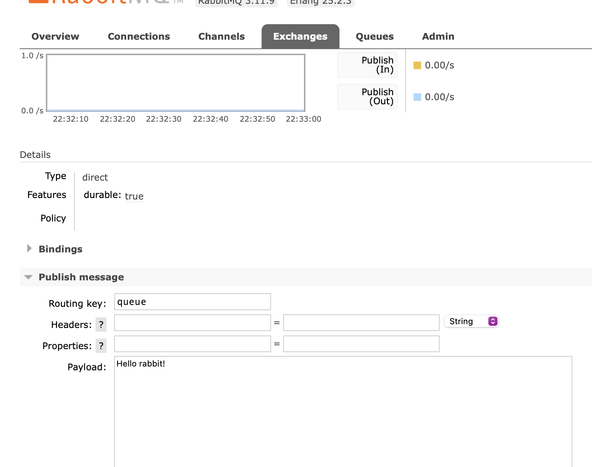

## project setup
`cd docker`  
`docker compose up`  
run/debug application - runs on port 8080
## accessing the rabbitMQ UI
open browser on: http://localhost:15672
> **user**: guest, **password**: guest

## sending test messages
You can send test messages using rabbitMQ CLI and by browser  
Prerequisite: queue must exist.  
For some reason you can't create queues on the browser, however here is the command to run in the docker container:  
`abbitmqadmin declare queue name=queue`
### message options

* **durable**: A boolean flag that indicates whether the queue should be durable, meaning that it will survive a broker
  restart. Default is true.
* **exclusive**: A boolean flag that indicates whether the queue should be exclusive, meaning that it can only be used
  by the current connection. Default is false.
* **autoDelete**: A boolean flag that indicates whether the queue should be automatically deleted when the last consumer
  unsubscribes. Default is false.
* **arguments**:  A map of additional arguments that can be used to configure the queue behavior. Some commonly used
  arguments include:
    * **x-message-ttl**: The time-to-live (TTL) for messages in the queue, in milliseconds.
    * **x-dead-letter-exchange**: The name of an exchange to which messages should be republished if they are rejected
      or expire in the queue.
    * **x-dead-letter-routing-key**: The routing key to use when republishing messages to the dead-letter exchange.
    * **x-max-length**: The maximum number of messages that the queue should hold.
    * **x-max-length-bytes**: The maximum size of messages that the queue should hold, in bytes.

### RabitMQ CLI

* open the Rabbit container via **bash**
    * docker ps: to view active conteiners
    * docker exec -it *"conteiner name"* bash
    * send the following command to
      terminal `rabbitmqadmin publish routing_key=queue payload='{"message": "Hello, RabbitMQ!"}'`
        * **routing_key**: The routing key is a message attribute that is used by exchanges to determine which queues to
          forward the message to. When a message is published to an exchange, it is published with a routing key that
          indicates which queue(s) the message should be routed to. The routing key can be any string value, and is
          usually used to describe the content or purpose of the message. Different types of exchanges use different
          routing algorithms to determine how to route messages based on the routing key.
        * **payload**: The payload, also known as the message body, is the actual content of the message that is being
          sent. The payload can be any binary data or text that needs to be transmitted. This can include serialized
          data structures, JSON, XML, or plain text.
        * **exchange**: An exchange is a message routing agent that receives messages from producers and routes them to
          queues. An exchange accepts messages with a routing key and forwards them to one or more queues based on the
          routing key and bindings. There are four types of exchanges in RabbitMQ: direct, topic, headers, and fanout.
          The type of exchange used depends on the routing algorithm required for the specific use case.

### Browser

* open browser: http://localhost:15672
* login
* navigate to Exchanges:
* fill the form
* 

# TODO
* Refactor this project not to use helmes as base application
